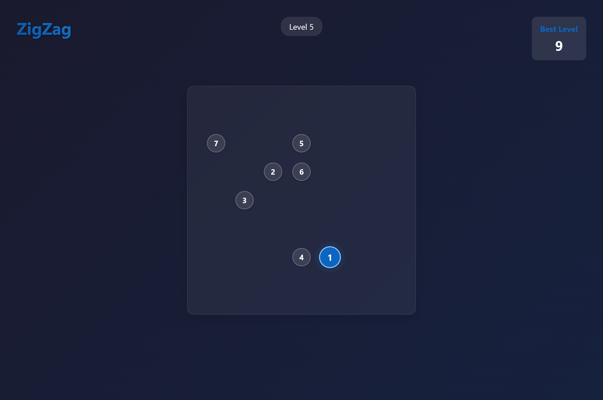

# Zigzag Game

A simple and addictive zigzag game implemented in JavaScript.



## Features

- **Smooth Controls:** Responsive keyboard or mouse controls for seamless gameplay.
- **Dynamic Path Generation:** The path changes direction, challenging your reflexes.
- **Score Tracking:** Keeps track of your best and current scores.
- **Game Over Detection:** Detects when the player falls off the path.
- **Minimalist Design:** Clean and simple UI for distraction-free play.

## Current Changes

- Improved collision detection for more accurate game over events.
- Enhanced path generation for increased difficulty.
- Refactored code for better readability and maintainability.
- Bug fixes and performance optimizations.

## How to Set Up the Project

Follow these steps to run the project on your computer:

1. **Clone the Project**:
   ```bash
   git clone https://github.com/SauRavRwT/ZigZag.git
   ```

2. **Go to the Project Folder**:
   ```bash
   cd ZigZag
   ```

3. **Install Required Packages**:
   ```bash
   npm install
   ```

4. **Start the App**:
   ```bash
   npm start
   ```

5. Open the app in your browser at [http://localhost:3000](http://localhost:3000).

## Contributing

We’d love your help! Feel free to fork the project, make changes, and submit a Pull Request.